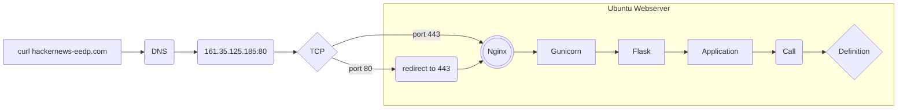

# Names: Emma Everding and Daniel Pijeira 
# Course ID: COP 4521 
# Group ID: 3 
# FSUID: ele20 dap19d

Curl is a command you can use to transfer data to or from a specified server. Many protocols are supported by curl, including HTTP/HTTPS/SFTP, etc. I used tcpdump to analyze the packets sent and received from my website after typing "curl http://hackernews-eedp.com" in another terminal window. First a packet starting a connection is sent from the IP address of the server. Then a packet acknowledgeing the connection is sent back to the server from our website. After that the server pushes a packet requesting data, in this case an HTTP GET request is sent to our website. Our website acknowledges that request and communicates with Nginx to pass this web client traffic (HTTP GET REQUEST) to the an entry point to an WSGI application server. Gunicorn is an application server that then takes this HTTP request and deploys the Flask application. The flask application is saved as a .py file. Importing the Flask class and using the route decorator on our app will tell Flask that our url should trigger the deployment of our website's code. Then a packet containing the data of the homepage is pushed. From our server, we acknowlege the data that was pushed, accept the packet, and send a packet that finishes the connection. Our website sends a packet acknowledging and finishing the connection. 
Security can be implemented through whitelisting IPs on both our Ubuntu server through ufw as well as the digital ocean droplet. Whitelisting IPs is a way to allow ssh attempts to be allowed from certain IP addresses. By whitelisting IP addresses on both of these platforms, it protects our server in the case of a zero-day vulnerability attacking Ubuntu or Digital Ocean, since it is extremely unlikely to happen to both at once. Another way we can implement security is by regularly scanning for open ports and applications running, which can be automated with some software. Using SSH keys improves security on our server by only allowing users who have the corresponding private key on their machine to connect.

We can achieve security by:
- Whitelisting IP
- Using VPN
- Scanning for Active Services
- Scanning for Open Ports
- Using SSH Keys instead of passwords

# Updates and Upgrades
Before handling upgrades on our system, we consistently create snapshots of our droplet system hosted on Digital Ocean before proceeding. This ensures that if our server were to malfunction or fail in terms of functionality, we could always roll back the server to a previous point of time when the snapshot was taken.

As for actually handling updates, we managed to configure automatic updates of important security updates and bug fixes using Ubuntu's unattended-upgrades service. In the configuration file for this service, we enabled several of the options such as Unattended-Upgrade::Remove-Unused-Dependencies to ensure there are no unused dependencies or kernel packages remaining on the system after an update. We've also added to the apt unattended-upgrades configuration file to handle kernel updates, however a reboot of the server is required causing downtime. In later versions we plan to add Canonical Livepatch service to ensure server uptime during kernel updates. 

**How to set up server docs:**
I have made copies of all the configuration files and placed them in a
directory named "config" (/home/emma/myproject/config). Below I will include
where the files are located throughout our server and their basic functionality.

**Nginx Files:**
myproject

    - located: (/etc/nginx/sites-available/ AND /etc/nginx/sites-enabled/)
    - functionality: This file includes our configuration for our website
                     and how we handle web requests. Our server block
                     listens on port 443 by default and passes the requests
                     to our gunicorn socket file (myproject.sock). Any
                     requests through port 80 and any version of our domain
                     name (http(s)://hackernews-eedp.com or http(s)://www.
                     hackernews-eedp.com) are redirected to port 443.

**Gunicorn:**
myproject.service

    - located: (/etc/systemd/system/)
    - functionality: This file will automatically start Gunicorn and serve
                     our flask application whenever the server boots. We
                     specify the user and group for the process to run under.
                     We specify a path in this file to allow the system to
                     know where the process's executables are located
                     (myproject.sock and wgsi.py).

**Fail2Ban**
jail.local

    - located: (/etc/fail2ban)
    - functionality: This file is used by the fail2ban service as a configuration
                     file that has all the settings we wish to apply to protect
                     our servers ssh service. Some of the choices I made were to
                     ban and email myself when an ip is banned. Also, I enabled
                     the nginx-http-auth.conf file to check for many login
                     attempts through our site within out /var/log/nginx/error.log
                    file.

**ssh**
For ssh we have turned off password authentification and allowed three users (emma,
daniel, and python) to log in via keys.

# Installation and Cloning
For this project we recommend installation on Ubuntu Server 20.04 LTS, as this project was made using this version. 

This can be found here: https://ubuntu.com/download/server

This project requires Nginx, Gunicorn, Flask, and Auth0.

Here are some guides we found useful for this process:

https://www.digitalocean.com/community/tutorials/how-to-install-nginx-on-ubuntu-20-04

https://www.digitalocean.com/community/tutorials/how-to-serve-flask-applications-with-gunicorn-and-nginx-on-ubuntu-20-04

https://auth0.com/docs/quickstart/spa/react/interactive

Once your server is configured with these packages, 
you may clone this repository with the following command in the terminal:

git clone https://gitlab.com/dpijeira1/web-application-project.git

A new directory will appear with the repository files. You can go to this new directory by typing:

cd web-application-project

>>>>>>> README.md
